<div align="center">



<br>

[](https://github.com/Vinod650754)
[](https://linkedin.com/in/vinodmv0717)
[](mailto:muddeshettivinod@gmail.com)
[](https://visitcount.itsvg.in)

</div>

<br>

## `IDENTITY // 01`



> I build practical software at the intersection of full-stack engineering, AI, and real-world problems.

<br>

<div align="center">

**"Why programming?"**
`Because I am a programmer.`

</div>

<br>

## `CURRENT SIGNAL // 02`

What the tracker is picking up right now — not a skills chart, just where the attention is going.

| STATE | READING |
|---|---|
| 🟢 **ACTIVE** | Java DSA · SQL |
| 🟡 **LEARNING** | Backend development · AI · Generative AI |
| 🔵 **EXPLORING** | Flutter · Open Source |
| ⚪ **QUEUED** | System Design |

<br>

## `ACTIVITY LOG // 03`

```
[ACTIVE]       Java DSA practice
[ACTIVE]       SQL learning
[BUILDING]     AI Resume Builder + ATS Analyzer
[PRODUCTION]   Spandana Website
[DEVELOPING]   ECN-Based Proportional Congestion Control
[EXPLORING]    Flutter
[EXPLORING]    Open Source
```

<br>

## `PROJECT SIGHTINGS // 04`

Status key used across every record below:
🟢 `CONFIRMED / ACTIVE`  🟡 `DEVELOPING`  🔵 `EXPERIMENTAL`  ⚪ `ARCHIVED / HACKATHON`

<br>

### 🟢 SIGHTING 001 — AI Resume Builder + ATS Analyzer
<sub>flagship record</sub>

| FIELD | READING |
|---|---|
| **STATUS** | 🟢 CONFIRMED — ACTIVE |
| **DOMAIN** | Full-stack · AI-assisted authoring |
| **OBJECTIVE** | A production-grade MERN application for writing and improving resumes with AI assistance, then scoring them against ATS systems. |
| **DETECTED CAPABILITIES** | JWT authentication · AI-assisted resume authoring · ATS analysis · PDF generation · email delivery · analytics · version history · live job matching · interview preparation · animated UI |
| **BEST FEATURE** | Resume building combined with PDF generation and direct email delivery, end to end in one flow. |

**TECHNOLOGY SIGNATURE**
          

[](https://github.com/Vinod650754/AiResumeAnyliser)
[](https://ai-resume-anyliser-client.vercel.app/)

<br>

### 🟢 SIGHTING 002 — Question For The Day (QFAD)

| FIELD | READING |
|---|---|
| **STATUS** | 🟢 CONFIRMED — ACTIVE, VERSION 1 |
| **DOMAIN** | Full-stack · Adaptive learning |
| **OBJECTIVE** | A production-ready adaptive learning platform: daily questions, AI-recommended follow-ups, XP, streaks, topic mastery, and leaderboards, with a full admin layer behind it. |
| **DETECTED CAPABILITIES** | Daily question delivery · AI-recommended questions · XP and streak tracking · topic mastery tracking · leaderboards · admin question scheduling · dataset import · user management · analytics · streak resets · content moderation |
| **BEST FEATURE** | Admin-side question scheduling paired with streak maintenance — the two systems that keep the platform alive day to day. |

**TECHNOLOGY SIGNATURE**
             

[](https://github.com/Vinod650754/QFAD)
[](https://qfad.vercel.app/)

<br>

### 🟢 SIGHTING 003 — Spandana Website

| FIELD | READING |
|---|---|
| **STATUS** | 🟢 PRODUCTION — VERSION 1 |
| **DOMAIN** | Full-stack · CMS · Social outreach |
| **OBJECTIVE** | The official platform for the Spandana Social Outreach Club at Sir MVIT — a CMS-driven site for managing and showcasing events, registrations, gallery, team, and community activity. |
| **DETECTED CAPABILITIES** | Event management · dynamic gallery · registrations · admin dashboard · content management without touching source code · responsive interface |
| **BEST FEATURE** | Administrators can update the site's content — events, gallery, team — through the CMS without ever modifying the source code. |

**TECHNOLOGY SIGNATURE**
       

[](https://github.com/Vinod650754/Spandana)
[](https://spandana-seven.vercel.app/)

<br>

### 🟡 SIGHTING 004 — ECN-Based Proportional Congestion Control

| FIELD | READING |
|---|---|
| **STATUS** | 🟡 DEVELOPING — not yet deployed |
| **DOMAIN** | Computer Networks |
| **FOCUS** | Explicit Congestion Notification (ECN) and proportional congestion control |

No public repository or implementation details yet — this one's still classified until there's something concrete to show.

<br>

<details>
<summary><strong>ARCHIVE — additional sightings</strong> (hackathon builds, experiments)</summary>
<br>

**⚪ AudioBook** — experimental repository, part of the wider build history.
[](https://github.com/Vinod650754/AudioBook)

**⚪ HAL_LORD_CODERS** — hackathon build: a demonstration webpage built for a company during a hackathon. Experimental, not a production platform.
[](https://github.com/muralimanohar018/HAL_LORD_CODERS)

</details>

<br>

## `TECHNOLOGY SCAN // 05`

<table>
<tr><td valign="top" width="50%">

**LANGUAGES**
<br>


**FRONTEND / MOBILE**
<br>


**BACKEND**
<br>


</td><td valign="top" width="50%">

**DATABASE**
<br>


**CLOUD / DEPLOYMENT**
<br>


**TOOLS**
<br>


**AI**
<br>


</td></tr>
</table>

<br>

## `AI SIGNAL WATCH // 06`

Not a research profile — this is AI as it shows up inside real applications I've shipped.

| SIGNAL | STATE |
|---|---|
| OpenAI / AI APIs | 🟢 USED IN PROJECTS |
| AI-powered applications | 🟢 ACTIVE |
| AI-driven recommendations | 🔵 EXPERIMENTING |
| Generative AI | 🟡 LEARNING |
| LLM applications | 🔵 EXPLORING |

<br>

## `ENGINEERING MAP // 07`



<br>

## `SYSTEM TELEMETRY // 08`

<div align="center">


**CONTRIBUTION SIGNAL**
<br>
<picture>
  <source media="(prefers-color-scheme: dark)" srcset="https://raw.githubusercontent.com/Vinod650754/Vinod650754/output/github-contribution-grid-snake-dark.svg">
  
</picture>

<sub>Snake renders once the workflow below has run at least once — see <code>GITHUB SETUP</code>.</sub>

</div>

<br>

## `ARCHIVES // 09`

```
/projects      → AI Resume Builder + ATS · QFAD · Spandana Website
/research      → ECN-Based Proportional Congestion Control
/experiments   → AudioBook
/hackathons    → HAL_LORD_CODERS
/learning      → Java DSA · SQL · System Design (queued)
```

<br>

## `OPEN CHANNEL // 10`

<div align="center">

[](mailto:muddeshettivinod@gmail.com)
[](https://linkedin.com/in/vinodmv0717)
[](https://github.com/Vinod650754)

</div>

<br>

<div align="center">


</div>
